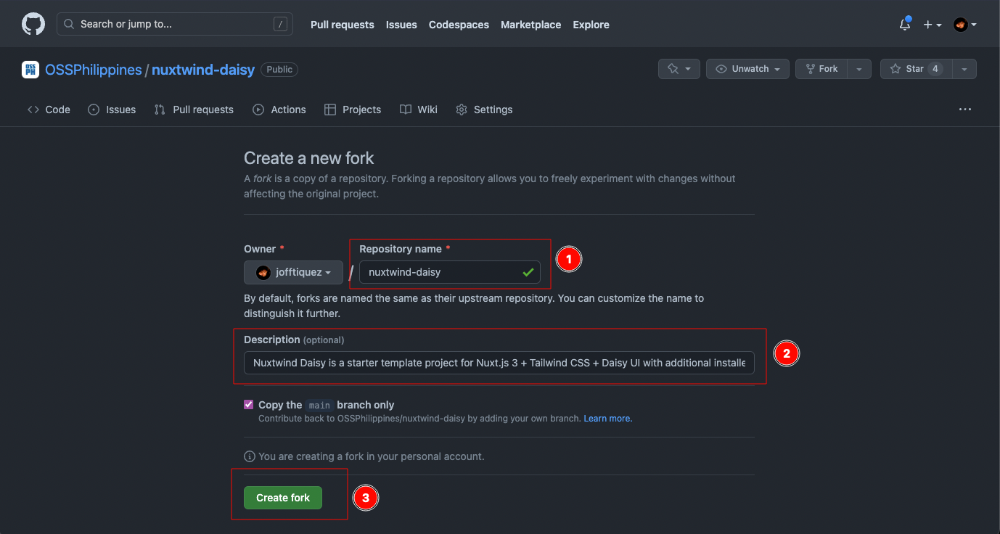

<p style="text-align: center">
  
</p>

<h1 align="center">Nuxtwind Daisy 🟢💨🌼</h1>
<p style="text-align: center">
Nuxtwind Daisy is a starter template for Nuxt.js 3 + Tailwind CSS + Daisy UI with additional installed setup for custom font, icons, animation, and more.
</p>

- [Showcase](#showcase)
- [Getting Started Guide](#getting-started-guide)

# Showcase

Brag your modified version from this template. 💪

- [jofftiquez.dev](https://jofftiquez.dev) 

# Getting Started Guide

## Installation

Nope. No installation needed.

## Fork

Fork this repository to your own GitHub account.


Make it yours. Rename it. Change the description. Hit Create fork.



## Make changes

I will assume that you already know the basic of nuxt.js. If not, you can check out their [documentation](https://nuxt.com/docs/getting-started/introduction).

Now that it's yours, you can make changes to it. Be creative you can start by removing the contents in the `pages/index.vue`. Feel free to utilize the `GenericPanel.vue` component as it adds a nice balance to the layout.

## Preview

You can preview your build by running the `nuxt start` command.

```bash
# Preview your build
$ nuxt start
```

## Build

You can choose to build it using the defaul strategy which is SSR, but you also have the option to generate static files so you can just upload your work in any static hosting service. The sample site of this repo is hosted in Vercel.


```bash
# Build for production using SSR
$ nuxt build
```

```bash
# Build for production and generate static files
$ nuxt generate
```

## Deploy

You can deploy your work in any static hosting service.

Here's a list of static hosting services that you can use:

- [Vercel](https://vercel.com/)
- [Netlify](https://www.netlify.com/)
- [Firebase](https://firebase.google.com/)
- [Surge](https://surge.sh/)
- [Render](https://render.com/)
- [GitHub Pages](https://pages.github.com/)
- [GitLab Pages](https://docs.gitlab.com/ee/user/project/pages/)
- [AWS Amplify](https://aws.amazon.com/amplify/)
- [Cloudflare Pages](https://pages.cloudflare.com/)
- [Begin](https://begin.com/)
- [Fast.io](https://fast.io/)
- [Fly](https://fly.io/)
- [Deta](https://www.deta.sh/)
- [Aerobatic](https://www.aerobatic.com/)
