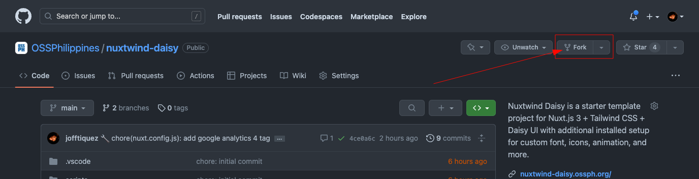
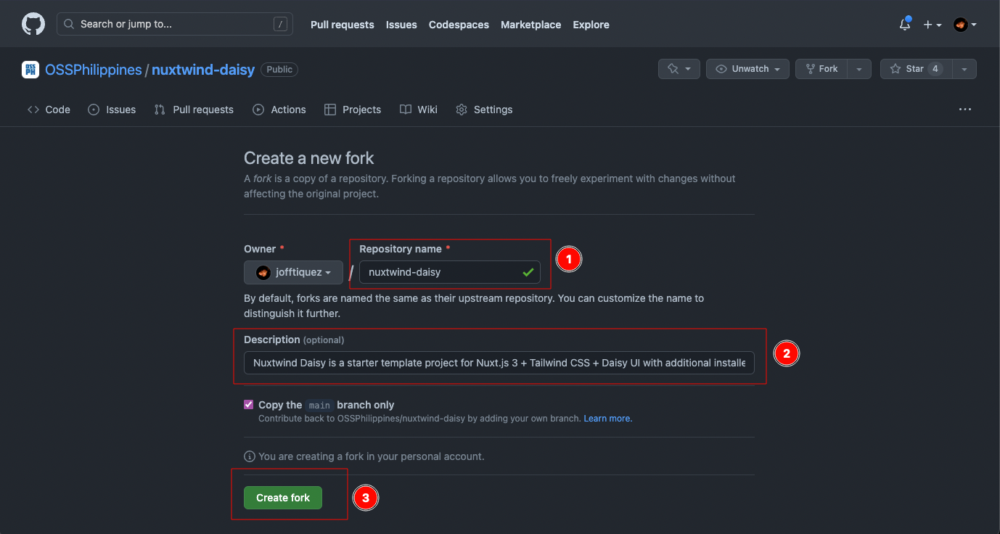

<p style="text-align: center">
  
</p>

<h1 align="center">Nuxtwind Daisy 🟢💨🌼</h1>
<p style="text-align: center">
Nuxtwind Daisy is a starter template for Nuxt 4 + Tailwind CSS 4 + DaisyUI 5 with additional installed setup for custom font, icons, animation, and more.
</p>

## Tech Stack

- **Nuxt 4.1.2** - The Intuitive Vue Framework
- **Tailwind CSS 4.1.13** - A utility-first CSS framework
- **DaisyUI 5.1.13** - Tailwind CSS component library
- **Vue 3.5** - Progressive JavaScript Framework
- **pnpm** - Fast, disk space efficient package manager

- [Showcase](#showcase)
- [Getting Started Guide](#getting-started-guide)

# Showcase

Brag your modified version from this template. 💪

- [jofftiquez.dev](https://jofftiquez.dev) 

# Getting Started Guide

## Prerequisites

- Node.js 20.x or higher
- pnpm 10.x or higher (recommended) or npm/yarn

## Installation

Clone the repository and install dependencies:

```bash
# Using pnpm (recommended)
$ pnpm install

# Or using npm
$ npm install
```

## Fork

Fork this repository to your own GitHub account.



Make it yours. Rename it. Change the description. Hit Create fork.



## Make changes

I will assume that you already know the basic of nuxt.js. If not, you can check out their [documentation](https://nuxt.com/docs/getting-started/introduction).

Now that it's yours, you can make changes to it. Be creative you can start by removing the contents in the `pages/index.vue`. Feel free to utilize the `GenericPanel.vue` component as it adds a nice balance to the layout.

## Development

Start the development server on http://localhost:3000:

```bash
# Using pnpm
$ pnpm dev

# Or using npm
$ npm run dev
```

## Preview

Preview the production build locally:

```bash
# Using pnpm
$ pnpm preview

# Or using npm
$ npm run preview
```

## Build

You can choose to build it using the default strategy which is SSR, but you also have the option to generate static files so you can just upload your work in any static hosting service. The sample site of this repo is hosted in Vercel.

```bash
# Build for production using SSR
$ pnpm build
# or
$ npm run build
```

```bash
# Build for production and generate static files
$ pnpm generate
# or
$ npm run generate
```

## Linting

This project uses ESLint 9 with the new flat config format:

```bash
# Run ESLint
$ pnpm lint
# or
$ npm run lint
```

## Deploy

You can deploy your work in any static hosting service.

Here's a list of static hosting services that you can use:

- [Vercel](https://vercel.com/)
- [Netlify](https://www.netlify.com/)
- [Firebase](https://firebase.google.com/)
- [Surge](https://surge.sh/)
- [Render](https://render.com/)
- [GitHub Pages](https://pages.github.com/)
- [GitLab Pages](https://docs.gitlab.com/ee/user/project/pages/)
- [AWS Amplify](https://aws.amazon.com/amplify/)
- [Cloudflare Pages](https://pages.cloudflare.com/)
- [Begin](https://begin.com/)
- [Fast.io](https://fast.io/)
- [Fly](https://fly.io/)
- [Deta](https://www.deta.sh/)
- [Aerobatic](https://www.aerobatic.com/)
